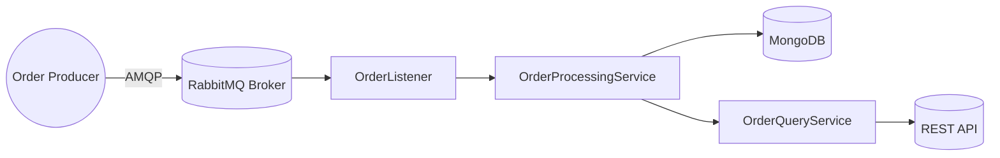

# Challenge - BTG Pactual

## Scope
Design and implement a message-driven microservice for processing and exposing order data in a scalable, containerized architecture. The service must asynchronously consume events, persist them, and expose a RESTful API for querying metrics.

## Technologies
- Java 21 (Spring Boot)
- **Messaging:** RabbitMQ (AMQP)
- **DB:** MongoDB
- **Containerization:** Docker

## Planning
1. **Environment setup**
2. **Data modeling**
3. **Message-consumer microservice**
4. **Service & repository layers**
5. **REST API** with OpenAPI documentation
6. **Testing**
   1. Integration tests (Testcontainers / MockRabbit + in-memory MongoDB)
   2. Unit tests (JUnit + Mockito)
   3. API contract tests (openapi4j)
7. **Technical report** (scope, diagrams, decisions, etc.)

## System Diagram



#### Docker Compose, orchestrating MongoDB, RabbitMQ, and the application service

### REST endpoints for order total retrieval, customer‑order counting, and order listing.
- GET /orders/{orderId}/total  
- GET /customers/{customerId}/orders/count
- GET /customers/{customerId}/orders

### OpenAPI endpoints
- http://localhost:8080/swagger-ui.html
- http://localhost:8080/v3/api-docs

### Postman
[BTG-Pactual Postman collection](BTG-Pactual.postman_collection.json)

## Quick Start

```bash
docker-compose up --build
```

### Future improvements: 
 - Extend API with pagination and filtering on order lists.
 - API contract tests (openapi4j)
